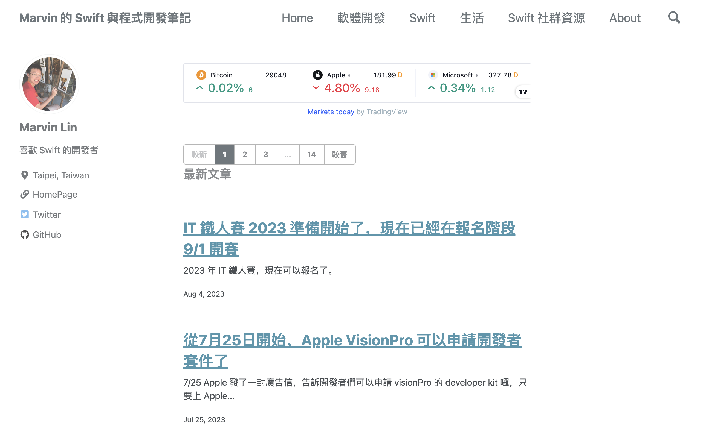

## MoonAndEye.github.io 網站

## Marvin Lin - 一個喜歡使用 Swift 進行開發的工程師

[](https://moonandeye.github.io/)

## 在 localhost 啟動

依賴 Ruby + Bundler + Jekyll（鎖在 `github-pages` 228）。

```bash
# 1. 安裝依賴（第一次 clone 後或更新 Gemfile 時跑）
bundle install

# 2. 啟動本地 server，預設網址 http://localhost:4000
bundle exec jekyll serve

# 草稿一起預覽
bundle exec jekyll serve --drafts

# 想換 port
bundle exec jekyll serve --port 4001
```

熱更新已內建，改 `_posts/`、`_layouts/`、`_includes/` 後重新整理瀏覽器即可；改到 `_config.yml` 要重啟 server。

## 客制化 Jekyll 加上去的 script
### 每月贊助的 banner，現在放在左邊 side bar
檔名: joinMembership.html

## 所有頁面上方的共用元件
是在 masthead.html 裡面，從 title 到 subtitle 都可以改

## 要加 <head></head> 或是 <body></body> 的地方
找到 _layouts/default.html, 在裡面添加對應的 html 即可

## 要加 <script></script> 的地方，如果你想添加 js 代碼
找到 _includes/scripts.html, 在裡面添加對應的 js 即可

### language switcher - for i18n
檔名: custom/language-switch.html
插在 _layouts/masthead.html title 後面

## 在上方 masthead.html 的分頁中